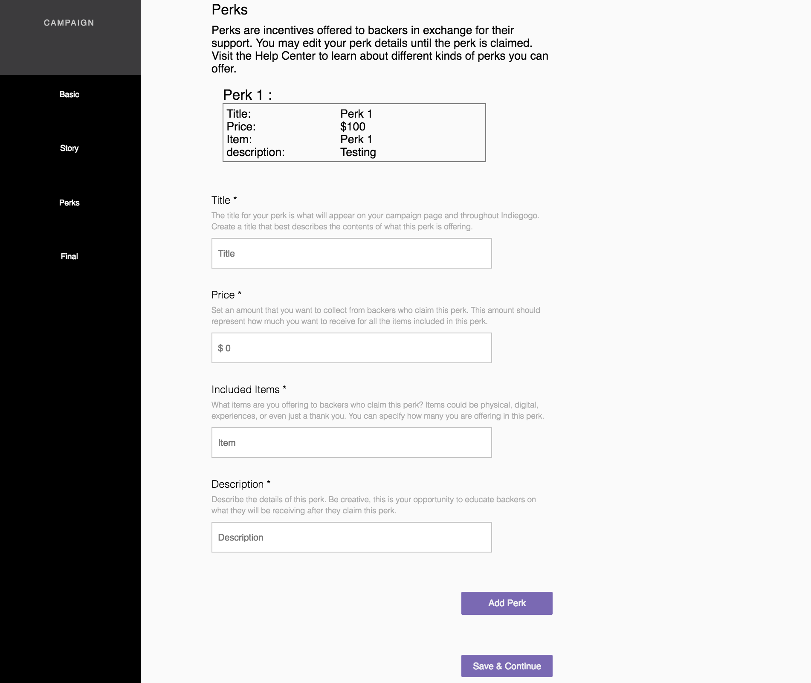
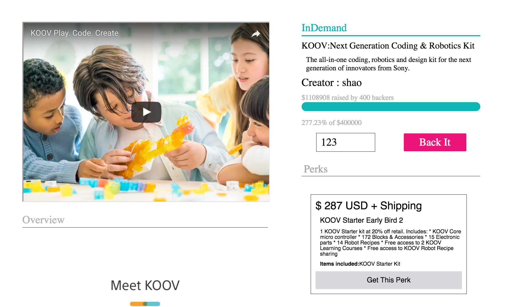

# S-MART


[SMART](https://smart-aa.herokuapp.com/#/)


S-Mart is full-stack web application clone of IndieGoGo, created using Ruby on Rails as the backend with PostgreSQL database and React.js with a Redux architectural framework on the frontend. Users are able to start funding campaigns or make contributions to campaigns they desire. (Because of academic purposes, no payment is accepted) Users can also receive perks from making contributions to campaigns. (No actual perks is being purchased).


## Features & Implementation
* Account creation and authentication
* Create Campaigns for fundraising or promote products
* Make contributions to campaigns
* View campaign show pages
    * Campaign video, Slogan/TagLine, Overview, Story, Perks for contributors
    * Options to make desire contribution amounts or contributions for perks
* Create a campaign in one go
    * No empty campaign was created in the backend. Instead, all campaign information is kept within the parent state and will be updated by passing "handling functions" as props to the child component.

---
```javascript
handleClick(target) {
  window.scrollTo(0,0);
  return () => {
    this.setState({ component: target });
  };
}

handleChange(input){
    return (e) => {
      window.scrollTo(0,0);
      this.setState({ [input]: e.target.value });
    };
}

handleRewards(reward){
    const rewardList = this.state.rewards_attributes;
    rewardList.push(reward);
    this.setState({ rewards_attributes: rewardList });
}
```
---
Each child component render will not effect the parent state.



A campaign can have multiple perks where we need to store them as an array of objects. In order to achieve that, our parent component will be an array and child component will keep track of the state of a new perk. Perk objects will be stored in the parent array when "Add Perk" is clicked and the state will reset.

---
```javascript
constructor(props) {
  super(props);

  this.state = {
    title: '',
    description: '',
    price: '',
    item: ''
  };

  this.handlePerk = this.handlePerk.bind(this);
}

update(input) {
  return e => this.setState({[input]: e.target.value});
}

handlePerk() {
  const reward = this.state;
  this.props.handleRewards(reward);

  this.setState({
    title: '',
    description: '',
    price: '',
    item: ''
  });
}
```
---
### Contributions



Users have the abilities to make desired contributions toward a campaign or contribute to the campaign for perks they like

---
```ruby
// user.rb ----
has_many :contributions,
  class_name: :Contribution,
  primary_key: :id,
  foreign_key: :user_id

has_many :rewards,
  through: :contributions,
  source: :reward

// contribution.rb ----
belongs_to :contributor,
  class_name: :User,
  primary_key: :id,
  foreign_key: :user_id
```

---


## Future Directions for the Project

Continue on User Profile and include options for edit campaign and allow the user to claim perks that do not require shipping. Such as coupon vouchers, Digital Keys, etc.

#### Commenting on the campaign show page
Front Page Carousel:
-- Top Carousel

Allow users to post questions on the campaign show page where campaign creator can post responses to questions or common Q/A.
